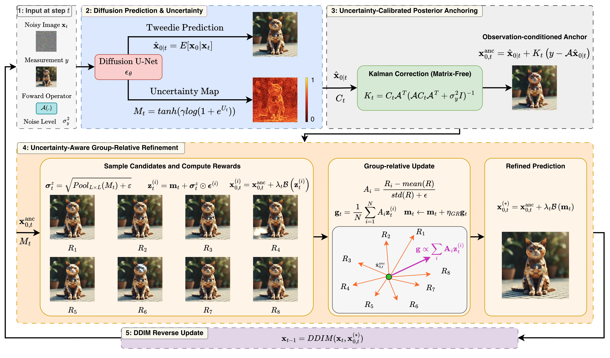

<div align="center">

# Uncertainty-Calibrated Posterior Anchoring with Group-Relative Refinement for Linear Inverse Problems

**Anonymous Authors**

</div>

<br>

<div align="center">

<a href="#"></a>
<a href="#"></a>
<a href="#"></a>
<a href="assets/supp/supp.pdf"></a>

</div>

<br>

---

## Overview Pipeline

<p align="center">
  
</p>

---

## Citation

```bibtex
@article{posterioranchoring2026,
  title  = {Uncertainty-Calibrated Posterior Anchoring with Group-Relative Refinement for Linear Inverse Problems},
  author = {Anonymous},
  year   = {2026}
}